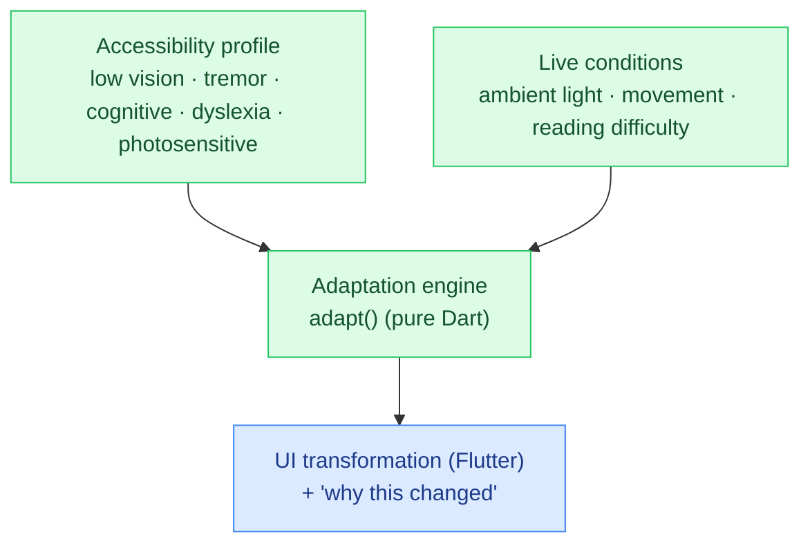

# SenseGuard

**▶ Live demo: https://parag-labs.github.io/sense-guard/** — a Flutter app running on the web
(also runs natively via `flutter run`). Everything is on-device; no backend, no API keys.

An **adaptive accessibility system**. Most accessibility is static — a setting you flip once.
SenseGuard continuously transforms the interface across **multiple dimensions** (text size,
contrast, spacing, tap-target size, motion, and language complexity) based on the user's
accessibility **profile** *and* live **conditions** (ambient light, movement, reading
difficulty) — and it always explains *why* it changed.

Toggle needs and drag the condition sliders to watch the sample screen transform in real time,
with a "why the UI changed" panel underneath.

---

## Why

Accessibility is still mostly static and single-dimension. Real-time, intelligent,
*multi-dimensional* adaptation that combines a profile with live signals — and stays transparent
and user-controlled — is scarce and socially valuable.

## Core idea

The adaptation is a deterministic engine in `lib/core/adapt.dart`, with no Flutter dependency:

- `adapt(profile, conditions)` → a `UiAdaptation` (text scale, contrast, spacing, tap-target
  scale, reduce-motion, simplify-language) **plus a list of plain-language `reasons`**.
- Effects from each active need and each live condition are additive and clamped, so combining
  several needs compounds sensibly and never runs away.
- `simplifyText(text, simplify)` swaps a few complex words for plain ones when simplification is
  on.

Keeping this pure means the accessibility logic is unit-tested and reproducible; the Flutter layer
just renders whatever the engine returns.

## Architecture



## Demo

```bash
flutter run -d chrome     # web
flutter run               # a device / simulator
```

Turn on **Low vision** (text and contrast grow), **Motor / tremor** (bigger, spaced controls,
motion off), or **Cognitive load** (wording simplifies), then push **Movement** up to see live
conditions layer on top.

## Design decisions

- **Multi-dimensional and additive.** Needs and conditions each contribute, then the result is
  clamped — so a user with several needs gets a sensibly compounded layout, not chaos.
- **Always explain.** Every change adds a human-readable reason shown in the UI. The user stays
  informed and in control (an explicit acceptance goal).
- **On-device.** The engine takes already-derived signals; in a real build the sensing (light,
  motion, reading behaviour) happens on-device.

## Testing

`flutter test` — 11 tests: each need's effect, photosensitive always reducing motion, the neutral
baseline, multi-need compounding within bounds, live conditions layering on top, determinism, and
the language simplifier.

```bash
flutter test
```

## Roadmap

- Learn a profile over time from real interaction signals.
- More adaptation dimensions (colour-blind-safe palettes, haptic cues, dwell control).
- Per-app profiles and smooth, reversible transitions.

## Layout

```
sense-guard/
├── lib/
│   ├── core/adapt.dart   # pure Dart: profile + conditions → UI adaptation (unit-tested)
│   └── main.dart         # the adaptive sample screen + controls + reasons
├── test/                 # 11 flutter_test unit tests
└── web/
```

## License

MIT — see [LICENSE](LICENSE).
